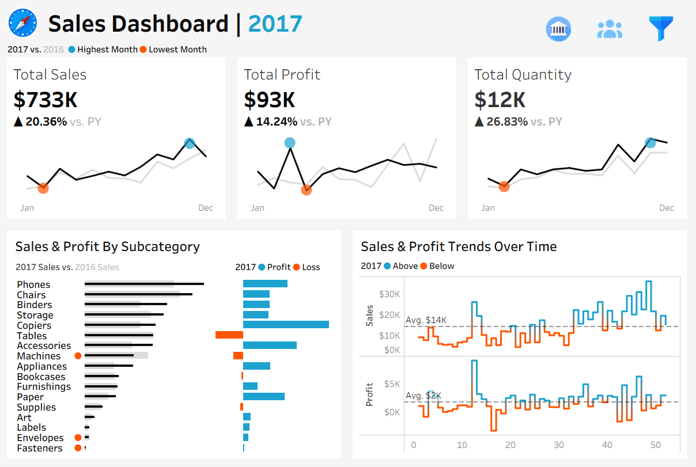
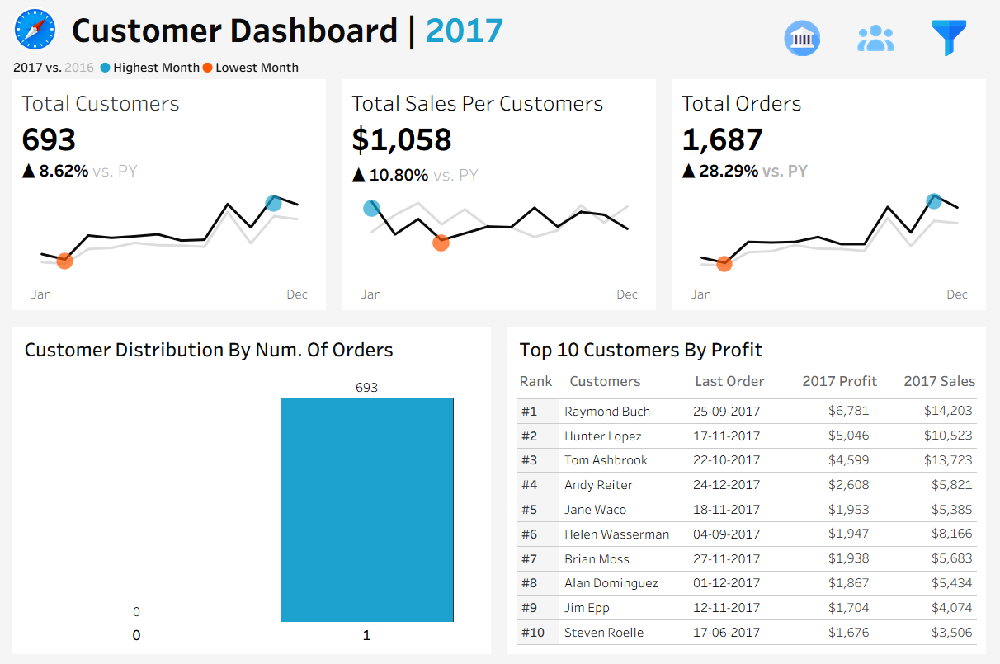

# 📊 Sales & Customer Analytics Dashboard

An interactive Tableau analytics project for evaluating sales
performance, profitability, customer behavior, product sub-categories,
and year-over-year business growth.

### The project contains two primary dashboards:

#### Sales Dashboard

#### Customer Dashboard

--

## 🎯 Objectives

Convert raw sales data into meaningful business insights.

Build KPI-driven dashboards for quick performance monitoring.

Compare 2017 performance against the previous year (2016).

Identify profitable and loss-making product sub-categories.

Analyze customer contribution and purchasing behavior.

Highlight high-value customers based on profit.

Create a clean, minimal, and business-focused Tableau dashboard.

# 🖥️ Dashboard 1 --- Sales Dashboard

Key KPIs

KPI                       2017 Result    YoY Change

💵 Total Sales         $733K   +20.36%
💰 Total Profit         $93K   +14.24%
📦 Total Quantity         12K   +26.83%

## What the dashboard shows

📈 Monthly sales performance with 2017 vs. 2016 comparison.

🔵 Highest-performing month and 🟠 lowest-performing month
indicators.

📊 Sales comparison by product sub-category.

💹 Profit vs. loss by sub-category.

📅 Sales and profit trends over time.

📉 Average sales and average profit reference levels.

### Business Insights

1. Strong overall sales growth

2017 generated approximately $733K in sales, representing a
20.36% increase over 2016. This indicates healthy revenue growth and
improved commercial performance.

2. Profit grew, but slower than sales

Profit reached approximately $93K, growing 14.24% YoY. Since
sales grew faster than profit, management should investigate margin
pressure, discounting, product mix, shipping costs, and other operating
factors.

3. Quantity growth outpaced revenue growth

Sales quantity increased by 26.83%, considerably faster than the
20.36% sales increase. This suggests that the business sold more units,
but the average revenue generated per unit did not increase at the same
pace.

4. Profitability is concentrated in specific sub-categories

The dashboard highlights strong contributors such as Copiers,
Accessories, Phones, Binders, and Chairs, while Tables, Machines,
Supplies, and Bookcases show profitability concerns.

### The underlying 2017 data shows particularly significant losses in:

🔻 Tables: approximately -$44.3K profit

🔻 Machines: approximately -$8.8K

🔻 Supplies: approximately -$5.6K

🔻 Bookcases: approximately -$3.5K

This makes these categories strong candidates for pricing, discount,
sourcing, and product-mix review.

# 👥 Dashboard 2 --- Customer Dashboard

Key KPIs

KPI                           2017 Result    YoY Change

👥 Total Customers            693    +8.62%
💵 Sales per Customer     $1,058   +10.80%
🧾 Total Orders             1,687   +28.29%

### What the dashboard shows

👥 Total active customer count.

💵 Average sales generated per customer.

🧾 Total order volume.

📈 Monthly customer and sales-per-customer trends.

📊 Customer distribution by number of orders.

🏆 Top 10 customers ranked by profit.

📅 Last-order information for high-value customers.

### Business Insights

1. Customer base expanded

The business served 693 customers in 2017, an 8.62% increase
compared with the previous year.

2. Customer value improved

Sales per customer reached approximately $1,058, increasing by
10.80% YoY. This indicates that the business is not only
acquiring/serving more customers, but also generating more revenue per
customer.

3. Order volume increased significantly

The business recorded 1,687 orders, a 28.29% YoY increase. Order
growth substantially exceeded customer growth, suggesting stronger
purchasing frequency and/or repeat-order activity.

4. High-value customers can be prioritized

The Top 10 customer view identifies customers contributing significant
profit. The leading customer generated approximately $6.8K profit
on $14.2K sales, while the top customer group provides a clear
starting point for retention, relationship management, and account-level
strategies.

## 📊 Combined Business Impact

The dashboards provide a management-level view of how the business
performed in 2017.

Growth Snapshot

💰 $733K total sales

📈 20.36% sales growth

💵 $93K total profit

📈 14.24% profit growth

📦 12,476 units sold

📈 26.83% quantity growth

👥 693 customers

📈 8.62% customer growth

🧾 1,687 orders

📈 28.29% order growth

💳 $1,058 sales per customer

📈 10.80% growth in sales per customer

### Management Takeaways

Area                    Observation             Potential Business
Action

💰 Revenue              Sales grew 20.36%   Continue successful
growth strategies

💹 Profit               Profit grew 14.24%, Review margins,
below sales growth      discounts, and costs

📦 Volume               Quantity grew           Investigate product mix
26.83%              and unit economics

👥 Customers            Customer base grew      Continue acquisition
8.62%               and retention
initiatives

🧾 Orders               Orders grew 28.29%  Strengthen
repeat-purchase
programs

💵 Customer Value       Sales/customer grew     Focus on upselling and
10.80%              cross-selling

⚠️ Tables               Large negative profit   Review pricing,
contribution            discounts, and costs

⚠️ Machines             Negative profitability  Evaluate
product/discount
strategy

## 🗂️ Dataset Information

The project uses four CSV datasets.

1. orders.csv

The primary transactional dataset containing 9,994 order-line
records.

Key fields include:

Customer ID

Order Date

Order ID

Product ID

Segment

Ship Date

Ship Mode

Discount

Postal Code

Profit

Quantity

Row ID

Sales

Role: Core fact table used for sales, profit, quantity, order,
customer, and time-based analysis.

2. Customers.csv

Contains customer reference information.

Records: 9,994 rows
Unique customers: 793

Fields:

Customer ID

Customer Name

Role: Provides customer names and supports customer-level analysis.

3. Products.csv

Contains product master/reference information.

Records: 9,994 rows
Unique Product IDs: 1,862
Unique Product Names: 1,850
Categories: 3
Sub-categories: 17

Fields:

Category

Product ID

Product Name

Sub-Category

Role: Enables product/category/sub-category sales and profitability
analysis.

4. Locations.csv

Contains geographic information associated with transactions.

Records: 9,994 rows
Cities: 531
States: 49
Regions: 4
Country: United States

Fields:

City

Country

Region

State

Postal Code

Role: Supports geographic analysis and provides location context for
transactions.

🔗 Data Preparation & Relationships

The datasets were structured around common business keys:

Orders
 ├── Customer ID ──────> Customers
 ├── Product ID ───────> Products
 └── Postal Code ──────> Locations

The transactional data was combined with customer, product, and location
attributes to create a unified analytical view in Tableau.

The dashboards use calculated aggregations such as:

SUM(Sales),-- SUM(Profit), SUM(Quantity), COUNTD(Customer ID), COUNTD(Order ID), Sales per Customer, Year-over-Year growth, Monthly trends, Sub-category profitability, Customer profit ranking

## 🎨 Dashboard Design

The dashboards were designed with a focus on:

Minimal and professional UI

KPI-first layout

Clear visual hierarchy

Consistent typography

Interactive filtering/navigation

Year-over-year comparisons

Highlighting positive vs. negative performance

Business-oriented visual storytelling

Custom dashboard icons were also included in the project dataset package
for navigation and visual identity.

# 📸 Dashboard Preview

Sales Dashboard

Place the dashboard screenshot in the repository as:

assets/sales-dashboard.png

Then use:

Customer Dashboard

Place the dashboard screenshot in the repository as:

assets/customer-dashboard.png

Then use:

